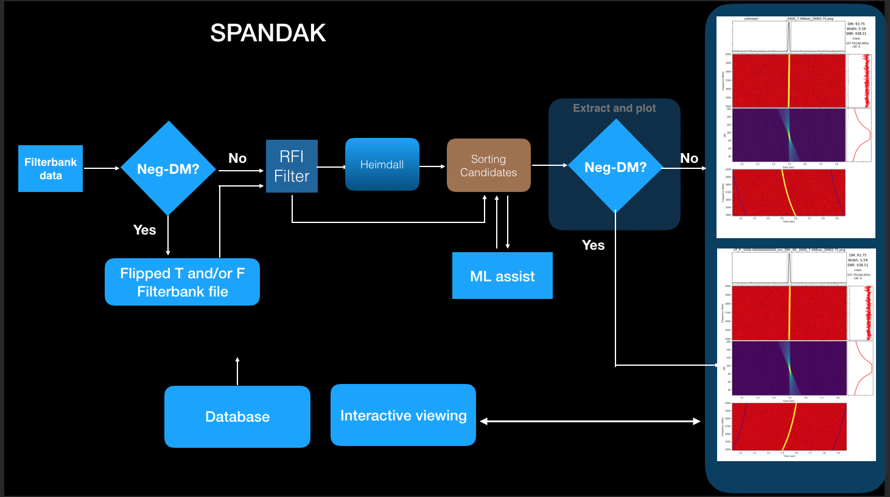
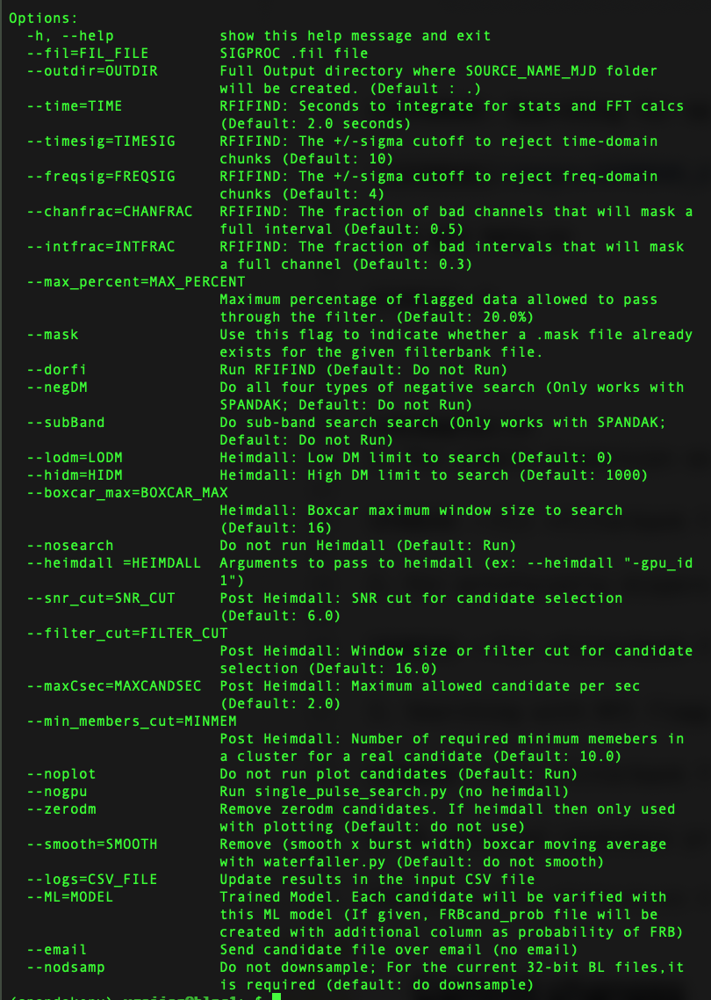

**INSTALLATION Instructions (Credit: Vinay Bharambe)**
[click here](https://github.com/gajjarv/PulsarSearch/blob/master/images/Pulsar_and_FRB_softwares_installation_manual.pdf)

**SPANDAK: Searching for naturally and artificially dispersed transient signals for Breakthrough Listen**

**To get help:**

SPANDAK -h

**Examples:**
1. For simple dispersion search across 0 to 1000 DMs. 

SPANDAK --fil file.fil 

2. For artificially dispersed signal search across 0 to 2000 DMs. 

SPANDAK --fil file.fil --negDM --lodm 0 --hidm 2000
	
3. Searching with RFI flagging

SPANDAK --fil file.fil --dorfi
	
4. ML assisted candidate prioritization. 

SPANDAK --fil file.fil --ML saved_model.h5

Dependencies: Please see above installation guide.  

**Understanding SPANDAK output without ML**

There are two main types of output from the SPANDAK pipeline. The first type is a text file with a list of final candidates named FRBcand. The columns in this FRBcand file are as follows:

This file has six columns, and their names are as follows:

	1.	snr: Signal-to-noise ratio of the bursts.
	2.	Time: Detected burst arrival time from the start of the file in seconds.
	3.	samp_idx: Index of the sample (similar to arrival time).
	4.	DM: Detected dispersion measure (DM) of the burst.
	5.	Filter: Detected width of the burst in units of N, where width = 2^N \times sampling time.
	6.	Beam number: For multibeam searches, the primary beam of the detected FRB.

The second type of output consists of .png plots, where each plot corresponds to shortlisted candidates. For each candidate, a t-test is performed on the broadbandness of the burst. These candidates are divided into three categories:

Candidates that start with:

	1.	B_: Candidates that showed a t-test value > 3 and the DM vs SNR curve showed a peak at the center.
	2.	C_: Candidates that showed a t-test value > 1 and the DM vs SNR curve showed a peak at the center.
	3.	Other candidates that did not fit the above criteria.

**Understanding SPANDAK output with ML**

If the SPANDAK pipeline was run with the ML code, then a separate text file similar to FRBcand is created, named FRBcand_prob. In this file, the first six columns are the same as mentioned above, with an added seventh column that shows the probability of that candidate being a real FRB.

Furthermore, in addition to producing the above-mentioned B and C category candidates, the code will also produce plots for candidates that start with:

	•	A_: These are candidates that showed more than a 5% probability of being an FRB. This threshold is kept low to reduce false negatives, which is more critical than getting a large number of false positives.

===================================================================================\
This is documentation on pulsar seach pipeline

The script requires following python import. 
numpy, sifting, optparse, math, time, os, sys, glob

---------------------------------------------------------------------------
To get help about usage : 
python Pulsar_Search_BL.py --h 
---------------------------------------------------------------------------
Short Logical flow of the script 

1. Make require dir and read input files. 
1a. For mpiprepsubband given --ndm will be adjusted to be divisible by 
    (--np - 1). The blk of DM which is defult 1000 will also be adjusted 
    be divisible by (--np - 1)
    	 

2. DDplan option execute depending upon given input of 0/1/2 
	--ddplan 0 : Runs DDplan.py script and it generates DDplan.out 
		     in the out dir. This file will be used to search for 
		     pulsar using prepsubband. Does not work with 
		     mpiprepsubband. 
	--ddplan 1 : It used hard coded DDplan generated considering normal
		     observations. Does not work with mpiprepsubband.  
	--ddplan 2 : It uses user input --lodm, --dmstep, --ndm.  

   Plan will be prepared here which will be used for mpi/prepsubband usage
	
3. RFI find with default hard coded block of 2048 which corresponds to ~ 2 sec
   for 1msec integration time. It creates mask and other files with suffix
   "Rfifind_output.*" This file will be created in the output dir. 
    The log file named "Rfifind_output.log" will be in the same output dir. 

4. Prepsubband or mpiprepsubband 
   Depending upon --mpi 0 or 1, prepsubband and mpiprepsubband will be executed    
   respectively. 	
   
   For both the above codes number of input dms are limited. 
   In case of prepsubb   and the number of DM will be divided in blocks 
   of 1000 for each execution. 
   For mpiprepsubband this number should also be divisible by user supplied 
   (number of port - 1). 

   This prog will generate several time series for the entire  DM range. 
 
5. Single_pulse_search.py : This needs all the .dat file created from the 
   prepsubband and it generates .singlepulse files for each .dat file. It also 
   generates *_singlepulse.ps plot to visually see single pulses in the DM vs time plot.    
   Output dir also contains singlepulse.log file. 

6. Realfft : This prog creates .fft file for each .dat time series file. 

7. rednoise will remove low frequency features from the .fft files. It will 
   creat _red.fft which will be replaced by .fft orignal files only. 

8. accelsearch will be carried out on this .fft files to find out possible 
   candidates. 
   Following is the defult accelsearch command. 

   > accelsearch -numharm 8 -sigma 6 -zmax 0 -flo 1 *.fft

   These values are hard coded in to the code. 
   Accelsearch will creat various *_ACCEL_0 files 

9. sifting.read_candidate : It will read all ACCEL files and 
   generate collective information about the candidate reported 
   in each of these files. 

10. sifting.remove_duplicate_candidates : 
     Remove lower-significance 'duplicate'(i.e. same period) 
     candidates from a list of candidates.  For the highest
     significance candidate, include a list of the DMs (and SNRs)
     of all the other detections. 

11. sifting.remove_DM_problems : 
    Remove the candidates where any of the following are true:
            1) The number of hits (2) is < numdms 
            2) The highest S/N candidate occurs below a DM of low_DM_cutoff (0)
            3) The minimum difference in DM indices between the hits is > 1
 
12. Candidate will be sorted according to their sigma level and final sorted
    list will be made into following file in output dir. 
    candidate_list_from_script 
    This file will have information about DM and Period of each significant 
    candidate found in the data set. All the candidate will be sorted according     
    their detected sigma level.  

    
13. Finding known pulsars : For each of the above found candidate, thier DM and 
   period will be compared to a list of know pulsars. For this 
   list of known pulsar which in file "psr_cats.txt" will be used. 
   In this file all the strong pulsars above 40 mJy and within observable 
   range of GBT as /listed. One can add more pulsar into this list but 
   the format of the file should not change.  
   The criteria for calling 	   
   perticular candidate a known pulsar is hard coded in the script. 
   They are as follows. 
   1. DM should be  +/- 5 to the DM of known psr
   2. Period is +/- 0.0005 sec of the period or harmoic of period of known psr .   
   The script will compare upto 10th harmonic of known pulsar period 
   to found candidate period
   For each match of the candidate with known pulsar the radial distance to
   that pulsar from the field center will also be calculated using 
   Haversine formula. 	

14. Prepfold : Only first 10 highest significant candidate will be folded.  
   For perpfold the DM and period of the sorted candidate will be used 
   to fold raw .sub??? files.  

15. For the candidate which does not match with any know pulsar they will be
   stored in array and will be reported in the final report file as Unidetified    
   Pulsating Objects (UPOs)

16. Final report file (report.log in output dir) will be made which will have 
    time stamp for each execution carried out in addition to total time taken by
    the script. It will also have information about the found known pulsar and 
    its harmonics. It will list all the found UPOs as well with their found DM,Period and Sigma. 

-------------------------------------------------------------------------------------------------
Examples : 

1. To carry out quick search of the data

python Pulsar_Search_BL.py --mpi 1 --np 8 --ddplan 2 --i GBT_Lband_PSR.fil --o <your output directory>

The input file should be given with full path. 
If the output dir does not exist it will creat one.  
If no --np option is given default 8 will be passed on to mpiprepsubband. 
Also if no --lodm or --ndm are given it will take range from 0 - 150 dm with dm step of 1. 

2. One can also give following type of option for finer dm search. 

python Pulsar_Search_BL.py --mpi 1 --ddplan 2 --lodm 0.0 --ndm 1000 --dmstep 0.1 --i GBT_Lband_PSR.fil --o <your output directory>

This will search from 0 to 100 Dm using dm step of 0.1

3. To run script using DDplan.py script following is an example. 

python Pulsar_Search_BL.py --ddplan 0 --i GBT_Lband_PSR.fil --o <your output direcory> 

One cant use --mpi option here because that is not yet implimented in the script for --ddplan 0 option. 
This will make DD plan from 0 to 1000 DM. 

-----------------------------------------------------------------------------------------------   
- Vishal Gajjar

For more information write to vishalg@berkeley.edu
------------------------------------------------------------------------------------------------
